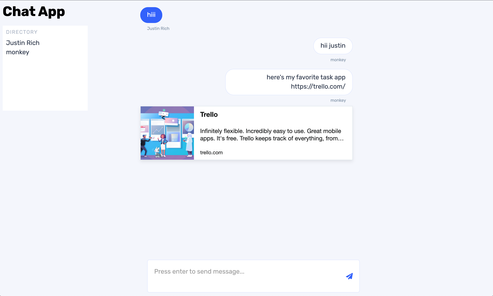

# Justin Rich Chat App

Application that utilizes **NextJS**, **React**, **Express**, and **Socket.io** to provide the user with a chat experience.

## Getting Started

1. Pull/fork repository
2. Install dependencies: `yarn install`
3. Add environment variables
    - in the **root** directory add a `.env` file
    - paste the following variables into your file as listed:
    ```
      PORT=3000
      HOSTNAME=localhost
      NEXT_PUBLIC_HOST=http://$HOSTNAME:$PORT
    ```
4. Boot up the server: `yarn start`

-   this will build your project the first time
-   NextJS is embedded within the server so there is no need to run `next`

5. Navigate to the client at `http://localhost:3000`

## Using the client

-   To start using the chat client enter your **name** and **email**

    -   your email will serve as the primary identifier on the server
    -   login screen:

        

-   You will see your name appear in the "directory" on the left

    -   chat room:

        

-   When new users come into the room they will also appear on the directory
-   Multiple chat users can be tested by opening multiple windows at the local URL
-   If you paste in a valid URL the system will attempt to render a rich preview of its metadata

## Areas for improvement

-   Data persistance
-   Custom link preview component, currently using [react-tiny-link](https://www.npmjs.com/package/react-tiny-link)
-   end to end testing, unit tests, integration tests
-   tags/mentions
-   message timestamps
